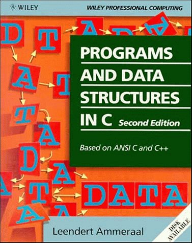

# Programs and Data Structures
This collection of programs and code snippets are inspired by the book,
Programs and Data Structures in C, second edition, based on ANSI C and C++, by Leendert Ammeraal

# Book Cover

# Chapters
1. Programming style, Iteration and Recursion
2. Array and File Manipulation
